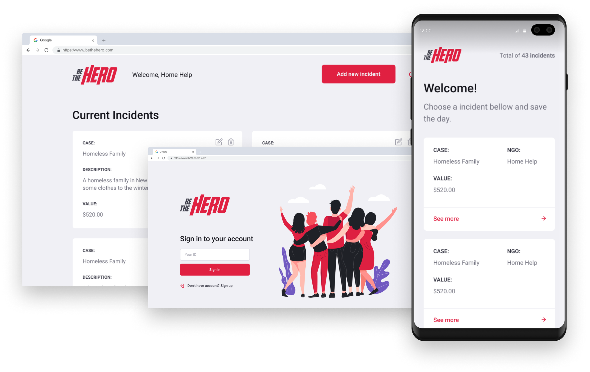
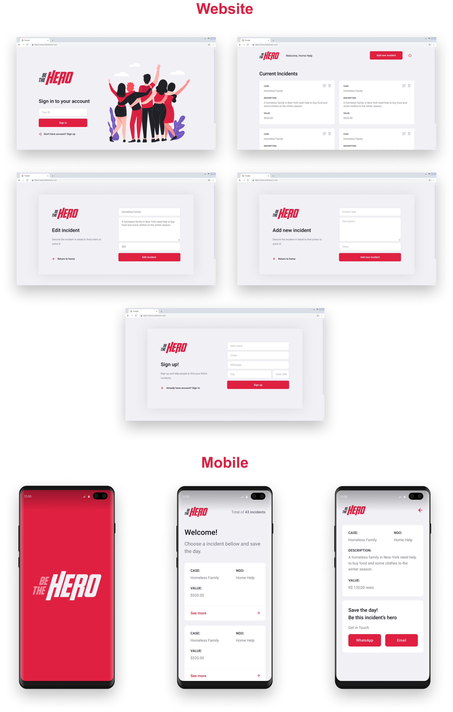

<p align="center">
  
  
  <p align="center">
  App made to bring together NGOs and people to volunteer and help the world!
  </p>

  

  > This project was made for learning purposes and comes from Rocketseat's Omnistack Week crash course #11
</p>

<h1 align="center">Technologies</h1>
<p align="center">
  
</p>

  <h1 align="center">Screens</h1>
<p align="center">
  
</p>

# Development setup

> yarn is required

After cloning this repo:
### Backend
  - Run ```npm install``` in the ```backend``` folder
  - Run ```yarn dev``` to up the server
  - Open ```Insomnia``` or ```Postman``` and import the ```Insomnia.json``` workspace file at ```backend``` folder
### Frontend
  - Run ```npm install``` in the ```frontend``` folder
  - Run ```npm start``` to up the project
### Mobile
  - Run ```npm install``` in the ```mobile``` folder
  - Run ```npm start``` to up the project

# License
[MIT License](/LICENSE)
